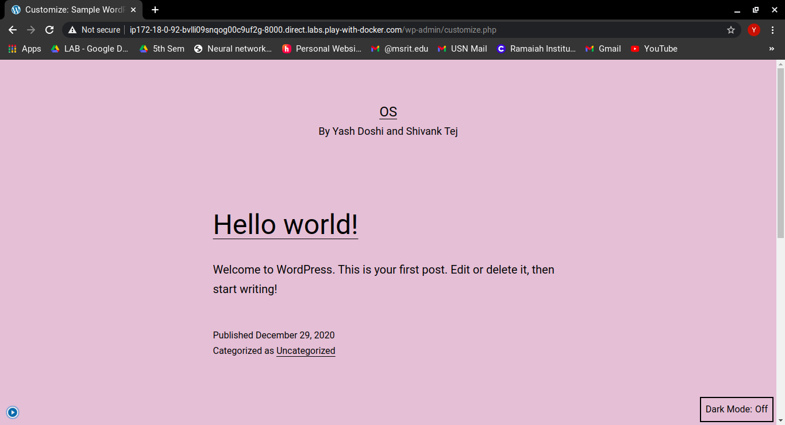
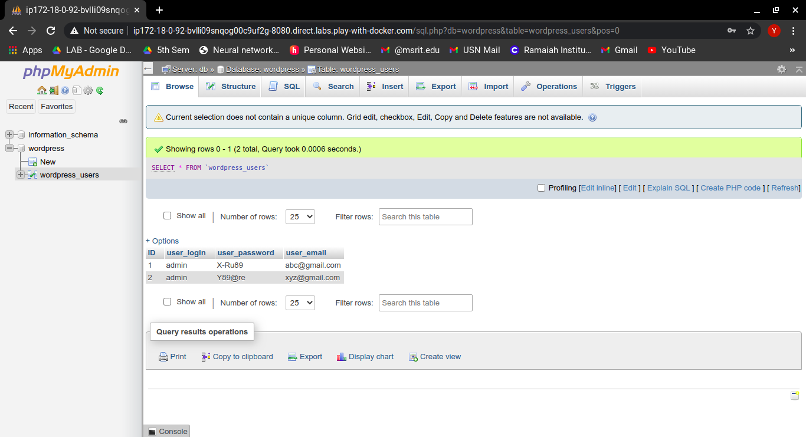
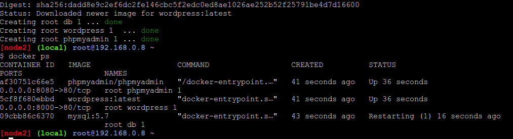

# OS-Docker_Assignment

# Team Members
Yash Doshi   1MS18CS139\
Shivank Tej  1MS18CS114

# Assignment3:
wordpress - mysql app

contianer1(mysql)

image: mysql:5.7

volumes:/var/lib/mysql

environment variables

MYSQL_ROOT_PASSWORD: somewordpress

MYSQL_DATABASE: wordpress

MYSQL_USER: wordpress

MYSQL_PASSWORD: wordpress

container2(wordpress)

 - image: wordpress:latest
 
 - port:80
 
 - environment variables
 
   - WORDPRESS_DB_HOST: db:3306
   
   - WORDPRESS_DB_USER: wordpress
   
   - WORDPRESS_DB_PASSWORD: wordpress
   - WORDPRESS_DB_NAME: wordpress
Note: Bring up the application on an user defined bridge network

Create a docker-compose file to bring up the application

# ScreenShots

